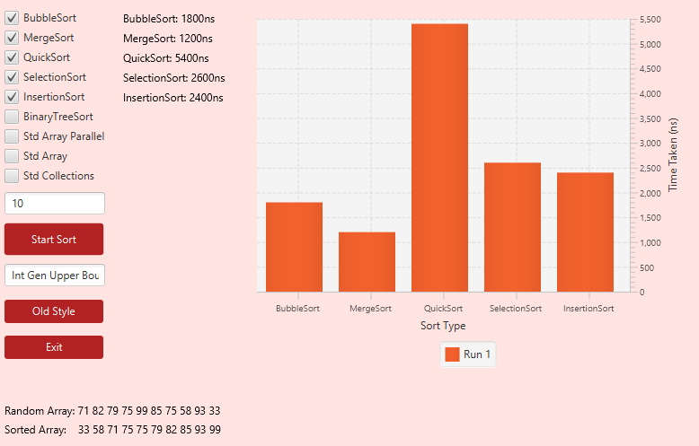

# Sort Manager Project

The Sort Manager Project, is a small application used to generate an array of random numbers and them sort them into numerical order.
## Table of Contents
1. [Introduction](#intro)
2. [Features](#features)
3. [Project Motivation](#project)
4. [Testing](#testing)
5. [License](#license)

## Introduction <a name="intro"><a/>
This is a very easy and intuitive to use
## Features <a name="features"><a/>
My Project contains a large number of special features that allow it to stand out from the crowd.
#### GUI
Namely an intuitive GUI that makes it far easier to use, as everything is spelled out for the user. 

However for those who prefer that school feel, we still have the option to swap to an older console style version of the system, however this does have a reduced number of features.
#### Check Boxes
No longer do they have to contend with clunky typed inputs instead I have implemented a simple Check Box system that allows multiple sorts to be run simultaneously for comparison.


#### Bar Chart
A Bar Chart makes the time comparisons far easier when it comes to larger numbers, as during the manual testing phase it became clear that when the numbers are large it becomes more difficult to differentiate between the results. 

## The Motivation behind the project <a name="project"><a/>
- A desire to improve my Java Skills by putting them into practice, using a number of the skills I have picked up over the past few weeks.

#### What problem does it solve?
- This project builds upon a concept that has in the past seemed fairly simple, the idea of sorting random numbers and comparing the times, and takes it further in a user first manner.
- Have you found it difficult to tell just how much faster your insertion sort is over you binary tree sort? well with the built in bar chart feature this is a thing of the past, using a visual representation its far easier and quicker to see just how big the time difference between the sorts is.

#### What did I learn?
- How to use JavaFX being a big one, as this had to be learned from scratch in a matter of days, there are a number of bugs within javafx that make it more difficult to use than it should otherwise be. An example of this is the animations on Bar Charts tend to glitch out and prevent the correct name labels appearing when first assigned, as well as causing issues with data overwriting.
- How to handle objects using an interface following a factory pattern.
- A greater understanding of the MVC pattern.


## Testing <a name="testing"><a/>

During various phases of development there has been a number of JUnit tests that have been carried out, here are couple from various sections of the application.

```java
@Test
public void givenArrayWithTwoEqualIntsReturnSortedArray(){
    int[] testArray = {12,12,54,1,20,10};
    int[] testSortedArray = {1,10,12,12,20,54};
    BinaryTreeSort theTreeTest = new BinaryTreeSort();
    int[] sortedArray = theTreeTest.sort(testArray);
    assertArrayEquals(testSortedArray, sortedArray);
}

@Test
public void givenTwoNumbersInAnArrayReturnSwappedNumbersInAnArray(){
    int[] myArr = {12,23};
    int[] mySwappedArr = {23,12};
    QuickSort.swap(myArr,0,1);
    assertArrayEquals(myArr,mySwappedArr);
}
```


## Future Project Direction <a name="future"><a/>
I Would like to continue working on this project so that all of the features I have in mind can be implemented however time may not allow this. therefore here are a few of the things I would like to see this do in the future.
- Average time Bar Chart that takes into account all of the previous test cases, the old data can be read in from a file and then after more testing is done this can be overwritten based on the new information.

## Help on readmes
[Click Me!](https://www.freecodecamp.org/news/how-to-write-a-good-readme-file/)

## License <a name="license"><a/>
[MIT](https://choosealicense.com/licenses/mit/)
